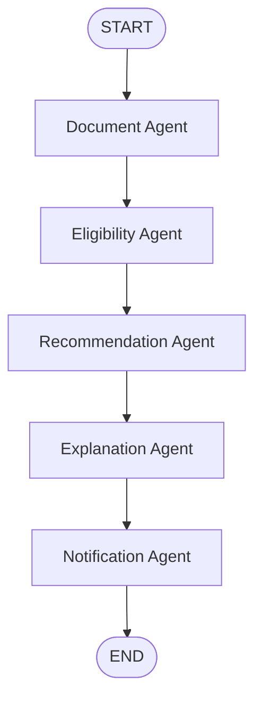

# CitizenOne – AI-Powered Government Welfare Recommendation Platform

**CitizenOne** is a production-ready, agentic AI platform powered by **LangGraph**, **FastAPI**, **Pydantic**, and **Groq Cloud LLM/Vision APIs**. It automates document OCR extraction, evaluates deterministic government eligibility rules, matches welfare schemes, generates conversational explanations, and provides structured calendar notifications.

---

## 🏛️ Architecture Overview

The system uses a **LangGraph StateGraph** to orchestrate specialized AI agents sequentially:



### Specialized Agents

1. **Document Agent** (`app/agents/document_agent.py`): Performs document OCR extraction on uploaded ID cards/income certificates using vision models (`qwen/qwen3.6-27b`).
2. **Eligibility Agent** (`app/agents/eligibility_agent.py`): Evaluates deterministic government eligibility rules (age parsing from DOB, income caps, residency checks, demographic validation).
3. **Recommendation Agent** (`app/agents/recommendation_agent.py`): Uses LLMs (`llama-3.3-70b-versatile`) to evaluate eligibility against welfare scheme categories.
4. **Explanation Agent** (`app/agents/explanation_agent.py`): Translates technical rule validations into conversational, citizen-friendly explanations.
5. **Notification Agent** (`app/agents/notification_agent.py`): Identifies missing document certificates, application deadlines, and renewal warnings as structured JSON alerts.
6. **Orchestrator Agent** (`app/agents/orchestrator_agent.py`): Executes the state graph and persists run metadata to the relational database.

---

## 📂 Codebase Directory Structure

```text
citizen-one/
├── backend/
│   ├── app/
│   │   ├── agents/
│   │   │   ├── document_agent.py
│   │   │   ├── eligibility_agent.py
│   │   │   ├── recommendation_agent.py
│   │   │   ├── explanation_agent.py
│   │   │   ├── notification_agent.py
│   │   │   └── orchestrator_agent.py
│   │   ├── api/
│   │   │   ├── upload.py         # Image upload OCR & pipeline endpoint
│   │   │   ├── recommend.py      # Profile JSON pipeline endpoint
│   │   │   ├── citizens.py       # Citizen profiles & history API
│   │   │   ├── logs.py           # AI Activity Console trace logs API
│   │   │   ├── notifications.py  # Calendar alerts API
│   │   │   └── health.py         # System health check API
│   │   ├── graph/
│   │   │   └── citizen_graph.py  # LangGraph workflow definition
│   │   ├── prompts/
│   │   │   └── prompts.py        # Centralized LLM prompt management
│   │   ├── schemas/
│   │   │   ├── document.py
│   │   │   ├── eligibility.py
│   │   │   ├── recommendation.py
│   │   │   └── response.py
│   │   ├── services/
│   │   │   ├── gemini_service.py # Groq LLM & Vision client wrapper
│   │   │   └── database_service.py # SQLAlchemy ORM models & CRUD
│   │   └── main.py               # FastAPI entrypoint with CORS
│   ├── tests/                    # Pytest test suite (13 unit/integration tests)
│   ├── requirements.txt          # Python dependencies
│   └── .env                      # API keys & configuration
```

---

## ⚡ Quickstart & Setup

### 1. Environment Configuration
Ensure `backend/.env` contains your Groq API key:
```env
GROQ_API_KEY=gsk_...
```

### 2. Install Dependencies
```bash
pip install -r backend/requirements.txt
pip install pytest pytest-asyncio
```

### 3. Run Development Server
```bash
python -m uvicorn app.main:app --reload --app-dir backend --port 8000
```
API Documentation will be accessible at: `http://127.0.0.1:8000/docs`

### 4. Execute Test Suite
```bash
python -m pytest backend/tests -v
```

---

## 🚀 REST API Reference

| Method | Endpoint | Description |
| :--- | :--- | :--- |
| `GET` | `/health` | Service health status |
| `POST` | `/api/v1/welfare/extract-document` | Upload document image & run multi-agent graph |
| `POST` | `/api/v1/welfare/recommend-schemes` | Pass citizen profile JSON & run multi-agent graph |
| `GET` | `/api/v1/welfare/citizens` | List all saved citizen evaluation profiles |
| `GET` | `/api/v1/welfare/citizens/{id}` | Get complete recommendation history for a citizen |
| `GET` | `/api/v1/welfare/logs` | Fetch AI Activity Console trace logs |
| `GET` | `/api/v1/welfare/notifications` | Fetch calendar alerts and reminders |

---

## 🛢️ Relational Database Schema

Configured with **SQLAlchemy ORM** (`citizen_one.db` SQLite/PostgreSQL):
- **`citizen_profiles`**: Citizen demographics (full_name, dob, gender, income_annual, state, district).
- **`documents`**: Processed document types and missing fields.
- **`recommendations`**: Matched scheme details, eligibility boolean, match scores, reasoning.
- **`notifications`**: Action alerts and calendar due dates.
- **`execution_logs`**: Step-by-step AI Activity Console logs and trace metrics.
